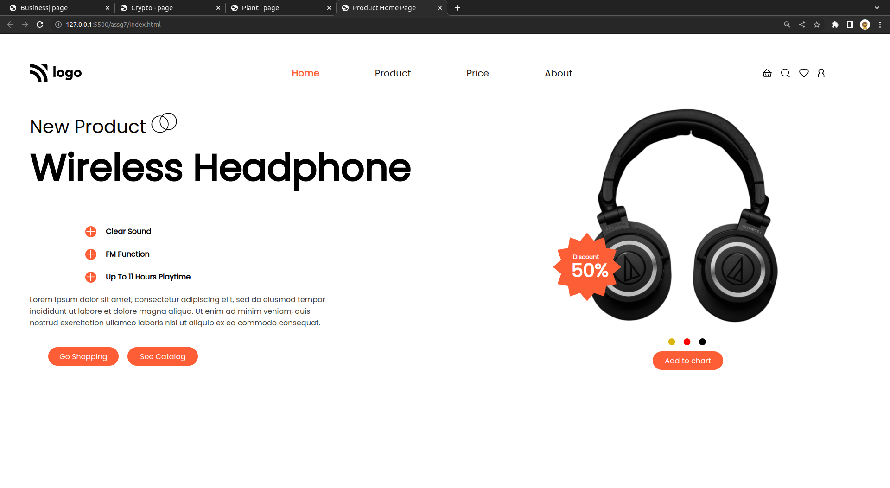

# Ecommerce | Page - HTML & CSS!

By Prince Kr Paswan

## [Link to the SEO-Page (project-3)](https://ecommerce-page.netlify.app/)

## What I learned While creating this page?

- Learned about icon background design.
- learned Z-Index.
- Learned how to chance the colour of Icons.
- Learnd to use css position  property.
- I learned how to add custom fonts.
- I learned about image positioning and image hight.

## This project took around 3.5 hours to complete.
